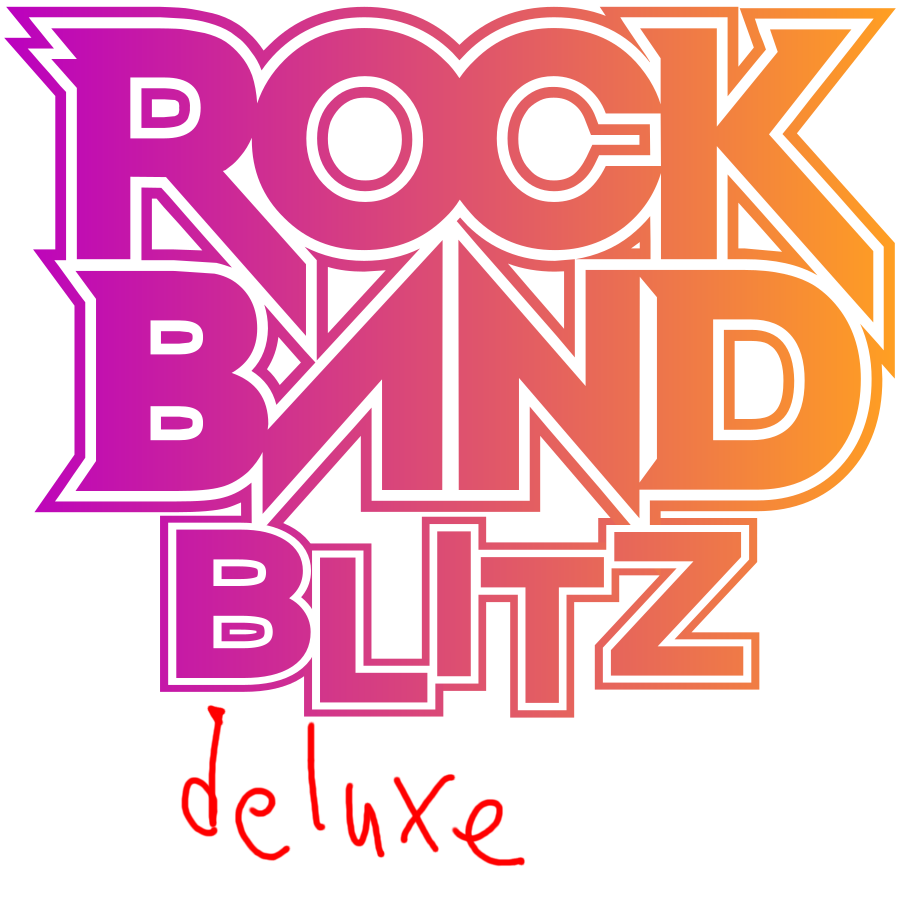

# Rock Band Blitz Deluxe

# Introduction

### Rock Band Blitz Deluxe is a Quality-of-Life Improvement Mod by [MiloHax](https://github.com/hmxmilohax)

This guide contains full instructions on how to install Rock Band Blitz Deluxe for PlayStation 3 or Xbox 360.

# Table of Contents  
- [Features](#features)
  - [Quality of Life](#quality-of-life)
  - [Authoring](#authoring)
  - [Additional Modifications](#additional-modifications)
- [What You'll Need](#what-youll-need)
- [Downloads](#downloads)
- [How to Install](#how-to-install)
  - [Installing on RPCS3 (Recommended for PC)](#installing-on-rpcs3-recommended-for-pc)
  - [Installing on PS3](#installing-on-ps3)
  - [Installing on Xbox 360](#installing-on-xbox-360)
  - [Installing on Xbox Series X/S (Xenia UWP)](#installing-on-xbox-series-xs-xenia-uwp)
  - [Installing on Xenia (Advanced)](#installing-on-xenia-advanced)
- [Optional Upgrades](#optional-upgrades)
  - [Songs](#songs)
  - [rb3_plus Keys Upgrades](#rb3_plus-keys-upgrades)
  - [Custom Textures](#custom-textures)
- [Repo Setup (Advanced)](#repo-setup-advanced)
- [Dependencies](#dependencies)

# Features

## Quality of Life
* 

## Additional Modifications
* 

# What You'll Need

### Playing Rock Band Blitz Deluxe requires these things:

- **A vanilla copy of Rock Band Blitz** for PS3 or Xbox 360 that you can extract onto your PC. The **USA** version is required for PS3 (`NPUB30749`)
- For Console: A **modded/hacked PS3 or Xbox 360** and a way to transfer files to it, we recommend using FTP
- For Emulator: A **mid-to-high-end PC** capable of running RPCS3

# Downloads

# How to Install

### ***NOT FINAL, THIS WILL CHANGE, IDK HOW THIS IS GONNA WORK FOR NOW***

## Installing on [RPCS3](https://rpcs3.net/) (Recommended for PC)

* **Install your North American copy of Rock Band Blitz** through the emulator. The [**official RPCS3 site covers this nicely**](https://rpcs3.net/quickstart).
  * Remember, **you need to be running** ***NPUB30749***. RPCS3 will tell you this in the game selection GUI under the `Serial` column.

* Download [**Rock Band Blitz Deluxe for PS3**](#playstation-3). 
  * Extract the zip and **drag and drop the `.pkg` file on top of the main RPCS3 window** to install it. Select `Yes` to confirm.

***Rock Band Blitz Deluxe is now installed!*** We highly recommend you check out [**Optional Upgrades**](#optional-upgrades) for songs and other cool stuff you can add to your game.

**To update Rock Band Blitz Deluxe**, [**re-download it**](#playstation-3) and repeat the above steps. You can click the `Watch` button (All Activity) to be notified about any updates that occur.

***Sidenote:*** *we recommend* ***enabling `Write Color Buffers`*** *for Rock Band Blitz to prevent any character model issues.*

## Installing on PS3

**NOTE: You WILL need a HACKED/MODDED (CFW or HFW/HEN) PS3 in order to play this mod on console. We hope this is clear.**

**NOTE: Rock Band Blitz Deluxe only works with** ***North American (`NPUB30749`)*** **copies of the game on PS3.**

* Download [**Rock Band Blitz Deluxe for PS3**](#playstation-3). 
  * Extract the zip and copy the `.pkg` file to the root of a FAT32 formatted USB drive.
  * Navigate to `Package Manager` and install it like any other package.

***Rock Band Blitz Deluxe is now installed!*** We highly recommend you check out [**Optional Upgrades**](#optional-upgrades) for songs and other cool stuff you can add to your game.

**To update Rock Band Blitz Deluxe**, [**re-download it**](#playstation-3) and repeat the above steps. You can click the `Watch` button (All Activity) to be notified about any updates that occur.

***Sidenote:*** *if your Guitar Hero or Rock Revolution drum kit shows up as the wrong instrument, download* [***this build***](https://nightly.link/hmxmilohax/rock-band-3-deluxe/workflows/build/main/RB3DX-PS3-stock-instrument-mapping.zip) *instead.*

## Installing on Xbox 360

**NOTE: You WILL need a HACKED/MODDED (RGH or JTAG) Xbox 360 in order to play this mod on console. We hope this is clear.**

* **Install your vanilla copy of Rock Band Blitz** to your console's hard drive.
  * In case anything goes wrong, we recommend that you **rename `default.xex` to `default_vanilla.xex`**.

* **Disable updates** for Rock Band Blitz in Aurora. Rock Band Blitz Deluxe rolls `TU5` into its base installation.

* Download [**Rock Band Blitz Deluxe for Xbox 360**](#xbox-360). 
  * **Copy the contents of it to where your copy of Rock Band Blitz is installed** (we recommend using FTP to do so). Select `Yes` to overwrite the files.

* We also recommend **clearing your song cache**, as well as your **system cache**.
  * *To clear your **song cache**, navigate to `System Settings > Storage > Rock Band Blitz` and delete the song cache.*
  * *To clear your **system cache**, navigate to `System Settings > Storage` and press `Y` to clear the system cache.*

***Rock Band Blitz Deluxe is now installed!*** We highly recommend you check out [**Optional Upgrades**](#optional-upgrades) for songs and other cool stuff you can add to your game.

**To update Rock Band Blitz Deluxe**, [**re-download it**](#xbox-360) and repeat the above steps. You can click the `Watch` button (All Activity) to be notified about any updates that occur.

## Installing on Xbox Series X/S ([Xenia UWP](https://github.com/SirMangler/xenia/releases))

**NOTE: You WILL need an Xbox Series X/S running in [Developer Mode](https://learn.microsoft.com/en-us/windows/uwp/xbox-apps/devkit-activation). We hope this is clear.**

* **Extract and copy your vanilla copy of Rock Band Blitz** to your USB drive.
  * In case anything goes wrong, we recommend that you **rename `default.xex` to `default_vanilla.xex`**.

* Download [**Rock Band Blitz Deluxe for Xbox 360**](#xbox-360). Xenia UWP currently does not have guitar support so you need to download one of the `Series X/S Xenia` versions.
  * **Copy the contents of it and paste them on top of your vanilla copy of Rock Band Blitz**. Click `Yes` to overwrite the files.

***Rock Band Blitz Deluxe is now installed!*** We highly recommend you check out [**Optional Upgrades**](#optional-upgrades) for songs and other cool stuff you can add to your game.

**To update Rock Band Blitz Deluxe**, [**re-download it**](#xbox-360) and repeat the above steps. You can click the `Watch` button (All Activity) to be notified about any updates that occur.

***Sidenote:*** *we recommend* ***enabling `Readback Resolve`*** *to prevent any character model issues.*

## Installing on Xenia (Advanced)

*Follow [**Repo Setup (Advanced)**](#repo-setup-advanced) first in order to properly follow this guide.*

* **Extract your vanilla copy of Rock Band Blitz** and copy the contents of the `gen` folder to `\_build\xbox\gen\`.

* Navigate to `_xenia` and **map your controller with x360ce**.
  * When it asks you to create `xinput1_3.dll`, create it and **rename it to `xinput1_4.dll`**.

* Then, **navigate to `windows_bats`** if you're on Windows or **`user_scripts`** if you're on Linux and **run `build_xenia` to automatically update, build, and run Rock Band Blitz Deluxe.**
  * *You need to run this script every time in order to play and update the game. `run_xenia` will run the game only and won't update and build it unless a new update is available, so you can use that if `build_xenia` takes too long.*

***Rock Band Blitz Deluxe is now installed!*** We highly recommend you check out [**Optional Upgrades**](#optional-upgrades) for songs and other cool stuff you can add to your game.

***Sidenote:*** *if your controller is mapped and recognized and still doesn't register any inputs, unplug it from your PC and plug it back in while Xenia is still open.*

***Sidenote:*** *if you're experiencing issues regarding character models, navigate to `_xenia`, open `xenia-canary.config.toml` in your text editor of choice, and change `gpu` from `vulkan` to `d3d12` and `d3d12_readback_resolve` from `false` to `true` (you may need to press `CTRL + F` to find these). This will fix all texture issues but will drastically affect the framerate, you also may experience BSODs. If you don't want to deal with any of this, we recommend using* [***RPCS3***](#installing-on-rpcs3-recommended-for-pc) *instead.*

# Optional Upgrades

*These are some optional, but very handy additions you can make to your Rock Band Blitz Deluxe installation.*

## Songs

You can find song packs compatible with Rock Band Blitz for both platforms on [**This Spreadsheet**](https://docs.google.com/spreadsheets/d/1-3lo2ASxM-3yVr_JH14F7-Lc1v2_FcS5Rv_yDCANEmk/edit#gid=0).

You can also use [**Onyx Music Game Toolkit**](https://github.com/mtolly/onyxite-customs) to generate your own custom song packs for Rock Band games or convert Xbox 360 packs to PS3, and vice versa. Converting custom songs from games like Clone Hero is a breeze.

### Installing Songs on RPCS3

* Download a PS3 song pack of your choice and open RPCS3.
* Drag and drop the song pack you want to install on top of the main RPCS3 window and select `Yes` to install it.

### Installing Songs on PS3

* Download a PS3 song pack of your choice and put it on the root of a USB drive.
* Open `Package Manager` and select the song pack you want to install.

### Installing Songs on Xbox 360

* Download an Xbox 360 song pack of your choice.
* Copy it to its respective folder.

***For RB3 LIVE files, install them to:***

***For RB3 CON files, install them to:***

***For RB2 LIVE files, install them to:***

### Installing Songs on Xenia (Desktop and UWP)

* Download an Xbox 360 song pack of your choice.
* Open Xenia, navigate to `File > Install Content`, and select your song pack(s) of choice. You can select more than one at a time.
  * Xenia supports both CON and LIVE files.

* If you're on Xbox Series X/S, copy the entire `content` folder to your USB drive. Click `Yes` to overwrite the files if it asks you to.

# Repo Setup (Advanced)

### Installing Required Dependencies

* Install [**Git for Windows**](https://gitforwindows.org/), [**Dot Net 6.0 Runtime**](https://dotnet.microsoft.com/en-us/download/dotnet/6.0/runtime), and [**Python**](https://www.python.org/downloads/) (version 3.9 or later).
  * Install **Git** and **Dot Net 6.0 Runtime** with their default options, and ***select "Add python.exe to PATH"*** on the **Python** installer.

* Open a **new command prompt** (press `Win+R`, type `cmd` and press Enter), type in `pip install gitpython`, and press enter. Close the command prompt when it's done installing.

### Initializing the Repo

* Go to the **[Releases](https://github.com/hmxmilohax/rock-band-3-deluxe/releases)** of this repo and **download `_init_repo.bat`** if you're on Windows or **`_init_repo.sh`** if you're on Linux.
  * Make a new **empty** folder, **put `_init_repo` in the folder, and run it**. This will pull the repo down for you and make sure you're completely up to date. **This will take some time.**

### ***The folder should look like this once it's done:***

***The Rock Band Blitz Deluxe repo is now set up!*** You can now return to [**Installing on Xenia (Advanced)**](#installing-on-xenia-advanced) or [**Custom Textures**](#custom-textures).

# Dependencies

[Git for Windows](https://gitforwindows.org/) - CLI application to allow auto updating Deluxe repo files

[Dot Net 6.0 Runtime](https://dotnet.microsoft.com/en-us/download/dotnet/6.0/runtime) - Needed to run ArkHelper

[Python](https://www.python.org/downloads/) - For user script functionality (NOTE: 3.9 or newer is highly recommended!)

[Mackiloha](https://github.com/PikminGuts92/Mackiloha) - ArkHelper for building Deluxe - SuperFreq for building .bmp_xbox highway images

[swap_rb_art_bytes.py](https://github.com/PikminGuts92/re-notes/blob/master/scripts/swap_rb_art_bytes.py) - Python script for converting Xbox images to PS3

[dtab](https://github.com/mtolly/dtab) - For serializing `.dtb` script files
